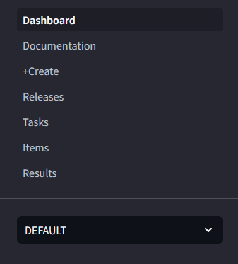
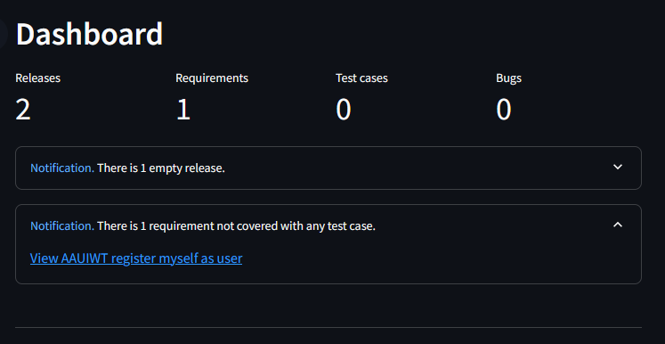
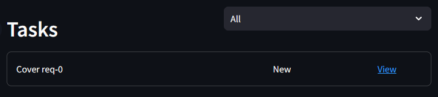

<h2>What is <i>ExultantRhino</i></h2>
Exultant Rhino is an <i>open source project management app</i> with main focus on providing solutions to facilitate project management, accelerating the work of developers and testers, covering all requirements with tests and monitoring bugs, as well as easier generation of project documentation and automation of backlog management.

<h2>About Rhino</h2>
Rhino/Rhinoceros _(Rhinocerotidae)_ is universally recognized by its massive body, stumpy legs and either one or two dermal horns.   
In some species, the horns may be short or not obvious. There are five main species among rhinos, which may differ in appearance,   
which you can read more about in following articles: 

[White Rhinoceeros](https://en.wikipedia.org/wiki/White_rhinoceros) , [Black Rhinoceros](https://en.wikipedia.org/wiki/Black_rhinoceros), [Indian Rhinoceros](https://en.wikipedia.org/wiki/Indian_rhinoceros), [Javan Rhinoceros](https://en.wikipedia.org/wiki/Javan_rhinoceros), [Sumatran Rhinoceros](https://en.wikipedia.org/wiki/Sumatran_rhinoceros). 

Rhinoceroses are killed by poachers for their horns, which are bought and sold on the black market for high prices, leading to most living rhinoceros species being considered endangered. The contemporary market for rhino horn is overwhelmingly driven by China and Vietnam, where it is bought by wealthy consumers to use in traditional Chinese medicine, among other uses.  
This animal was chosen as mascot for this project to raise awareness, that the current fate and future of many species depends on ancient human beliefs in the healing and sometimes even magical possibilities of materials or body parts obtained from animals, which have no scientific support.


_source:_ [Rhinoceros - Wikipedia](https://en.wikipedia.org/wiki/Rhinoceros)

<h2>How to setup</h2>

<h3>Database setup</h3>

As far as it is still beta release, there is no support for external databases other than PostgreSQL yet. It is recommended to use database declared in _docker-compose-local.yml_ by running:\
```docker compose -f docker-compose-local.yml up -d db```

<h3>Application setup</h3>
Before starting application make sure you have got <i>.env</i> file available in project root directory. Simple rename of <i>example.env</i> is enough to make application work without additional configuration.

Simply start application by calling:
```docker compose up -d```

<h2>How to use</h2>
<b>NOTE: This is still beta release and layout may change in the future.</b>

<h3>Foreword</h3>
The main goal of ExultantRhino project is to deliver tool, that simplifies project planning, makes requirements vs. tests matrix coverage implementation easier and accelerates backlog and sprint maintenance on daily basis. 
The main idea behind this tool is based on one to multiple topdown object type correlation. 
Project may have multiple releases attached, as well as each release may have multiple requirements, but from bottom to top perspective each bug, test case, requirement, release has only one parent. 
With this simple solution it is easier to track all objects inside project, but also it opens possibility to automate a lot of actions.

<h3>How to start</h3>

Firstly, go to your local instance of ExultantRhino e.g http://localhost:8501 (or any server where instance is running on port 8501).

<h5>Navigation bar</h5>
Navigation bar is located on the left hand side. By using it you can move from page to page, but also choose current project that you work on.



<h5>Dashboard</h5>
Dashboard is main page where project summary can be found. There are pieces of information about number of active releases, requirements, test cases and bugs.
If any release is empty (has no requirement attached), requirement not covered with test case or bug is active you will see proper notification about that fact and also direct links to all items.



It is planned to extend this page with graphs describing project in much better details.

<h5>Documentation</h5>
Documentation page is separate place dedicated for users to define it by themselves and put project description, manuals, important notes etc. there.
To which in this project case is just the same README.md file that you are currently reading from so documentation would look just the same way as top page of this markdown.


<h5>+Create</h5>
Create page is where items creation happens. 
By choosing object type you can later fill item name, description and from Requirement type down - parent object as well. 
Please note that project value is greyed out, so before creation double check if chosen project is correct :)


<h5>Releases</h5>
After release creation all available releases are visible here. 
You can activate target one and that will generate correlated tasks. 
If any new item is created simply use Refresh to generate missing tasks.
Keep in mind that release can only be finished when 100% of tasks are done.


<h5>Tasks & Items</h5>
All created tasks and items with View page urls and statuses. Items can be additionally filtered by available releases and tasks by their statuses. It is all to manage views in more convenient way.




<h5>Results</h5>
All uploaded results with pass rate and correlated url to Jenkins build. Results can be added via API, and it is planned to add separate tool for that, so that it can be also used in reporting stage of CI/CD job execution.


NOTE: This page's layout will be revamped in one of next releases.

<h5>Configuration</h5>
<i>To be implemented in next release.</i>

Happy Rhinoing ;)

_mcieciora_